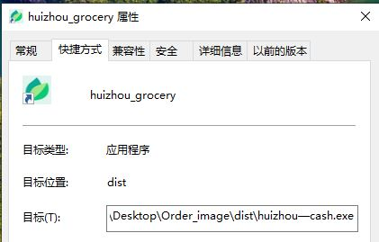
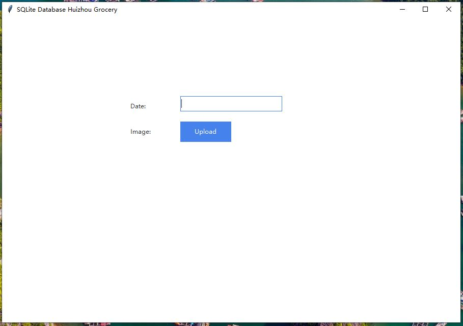

<div align="center">
  <h1 align = "center">Python Tkinter Upload Files to Sqlite</h1>
</div>

[](/LICENSE)

This is an open-source GUI desktop software designed to upload files to sqlite on our desktop.

When you are using the Windows system environment, you can download python file and run this script below on your terminal.

<p align="center">
  
</p>

```shell
pyinstaller --onefile --name huizhou-grocery -i logo.jpg --windowed huizhouGrocery_Tkinter.py
```


After that, you will get an exe file in your working directory.


<p align="center">
  
</p>

We could test our software in a Windows environment.

<p align="center">
  
</p>

<p align="center">
  
</p>

Once you input dates or some words and click upload, you will start to select your files that will be uploaded to your local sqlite database(not remote server). Your selected files(images, xlsx) will be converted to BLOB data and stored in sqlite.

<p align="center">
  
</p>

We are developing some software programs to support our POS (point of sale) system. This is our open-source project. Python code could be cross-platform for many users (like Linux environment).


